1. 打开aws.amazon.com，点击创建免费账户，注册的时候会要求绑定信用卡，冻结1美元。
2. 登录账户，点击右上角地区，选择亚太首尔：<br>
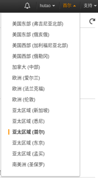
3. 点击左上角的服务，选中EC2<br>
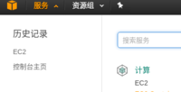
4. 点击EC2控制面板中的“启动实例”<br>
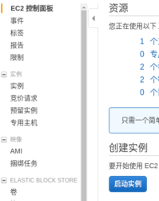
5. 选择ubuntu：<br>
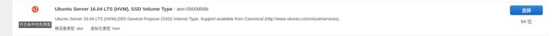
6. 选择t2.micro：<br>
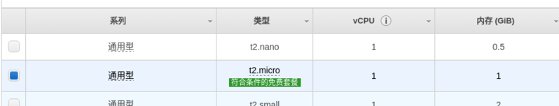
7. 点击右下角的“审核和启动”：<br>
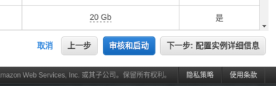
8. 点击编辑安全组：<br>

9. 添加规则，添加内容如图所示，添加完成后，点击“审核与启动”<br>
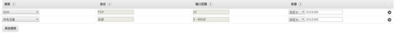
10. 点击启动：<br>
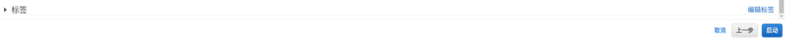
11. 选择创建新密钥对，随便输入一个名称，点击下载密钥对，下载完成后，点击启动实例。注意：把下载的pem文件保存好，丢了就连不上服务器了。<br>
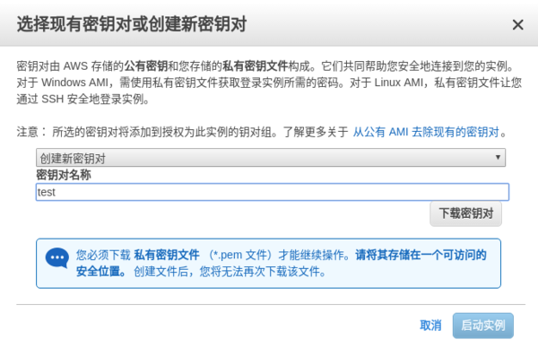
12. 创建成功后，点击查看实例<br>
13. 选中实例，点击连接<br>
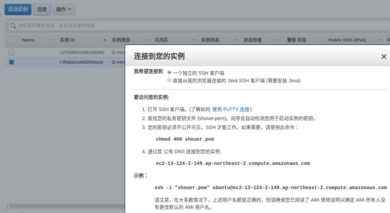
14. 在命令行输入示例提示的内容，登录服务器：<br>
```
ssh -i "shouer.pem" ubuntu@ec2-13-124-2-149.ap-northeast-2.compute.amazonaws.com
```
15. 登录服务器后，切换到root用户，下载shadowsocks-go语言版本
```
sudo -i
wget https://github.com/shadowsocks/shadowsocks-go/releases/download/1.2.1/shadowsocks-server.tar.gz```
目前go语言版本的shadowsocks的版本是1.2.1，大家搭服务器的时候，可以去git上面看看版本有没有更新，有更新最好用最新的版本<br>
16. 解压
```
tar -zxvf shadowsocks-server.tar.gz
```
17. 创建config.json，输入以下内容：
```
vi config.json
{
    "server":"xxxxx",
    "server_port":8388,
    "local_address": "127.0.0.1",
    "local_port":1080,
    "password":"xxx",
    "method": "aes-128-cfb",
    "fast_open": true,
    "timeout":600
}
```
注意：其中的server为服务器局域网内的ip地址，可以通过 ifconfig 命令查看，password可以随意输入，只要客户端和服务器的一致就行。
18. 执行
```
nohup ./shadowsocks-server
```
服务器搭建完成

19. 客户端（自己电脑）
```
sudo add-apt-repository ppa:hzwhuang/ss-qt5
sudo apt-get update
sudo apt-get install shadowsocks-qt5
```
20. 打开 shadowsock-Qt5<br>
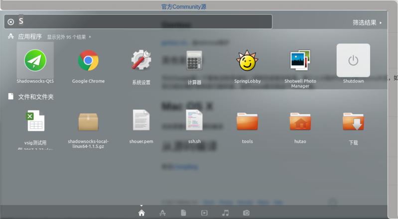
21. 选择连接-添加-手动<br>
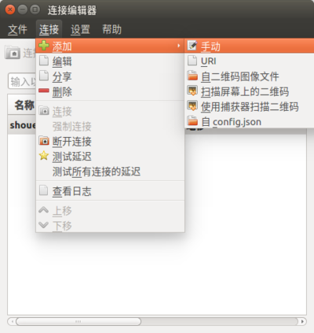
22. 输入服务器地址（服务器的公网地址）、端口、密钥（对应服务器config.json文件中的password）、加密方式保存。<br>
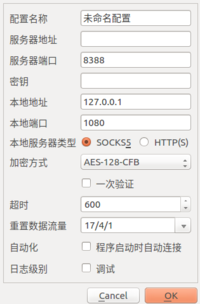
23. 保持成功后，选择测试延迟，并连接服务器。
24. 浏览器配置：
火狐安装：<br>
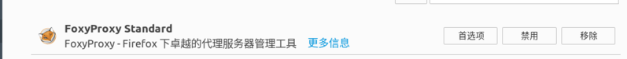
chrom:<br>
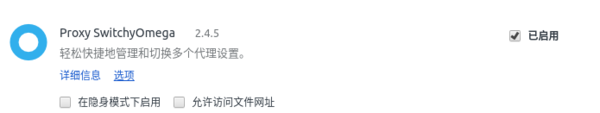

火狐配置：<br>
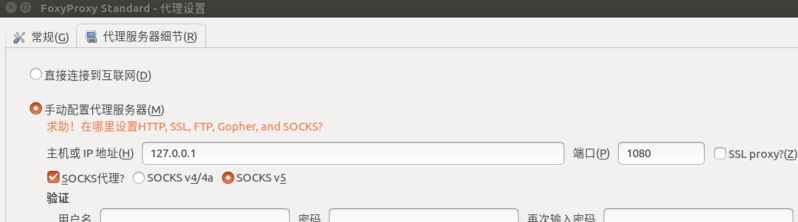
chrom配置：<br>
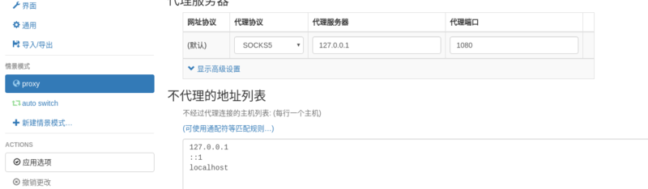
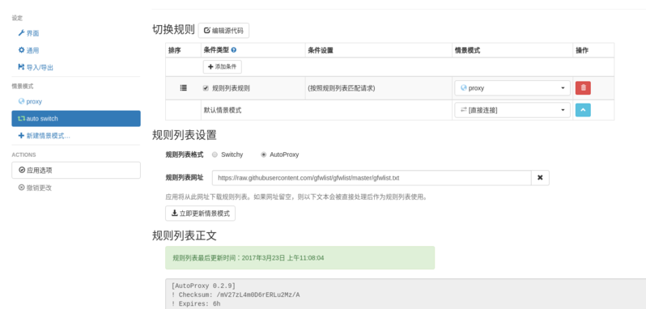
这样，浏览器就可以上google了

25. 全局代理：
```
git clone https://github.com/rofl0r/proxychains-ng.git
./configure --sysconfdir=/etc
make
sudo make install
sudo make install-config
sudo vi /etc/proxychains.conf
```
修改最后一行的内容为：<br>
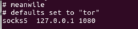

运行命令：`proxychains4 wget www.google.com `测试

26. 最近google云免费送300美金,可以使用。延迟只有55ms，比亚马逊快很多
